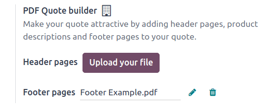
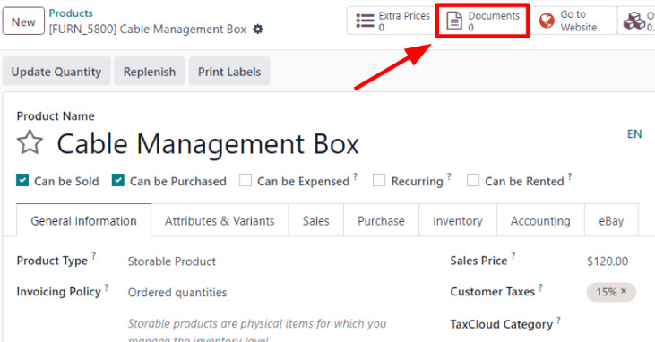
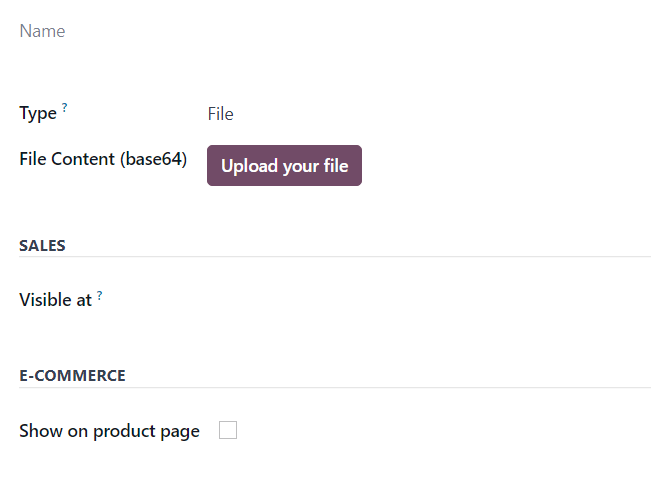
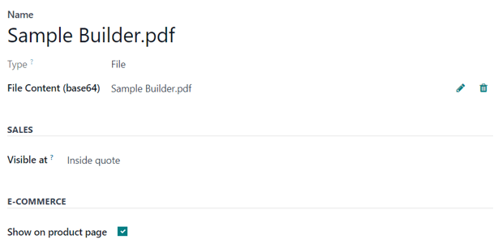
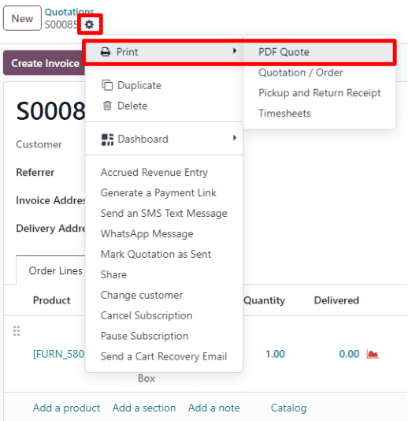

=================
PDF quote builder
=================

The *PDF Quote Builder* in Odoo *Sales* provides the opportunity to export a fully-custom PDF file
for quotes, showcasing various information and design elements, instead of just the price and total.

The PDF Quote Builder can be used to add header pages, product descriptions, and footer pages to a
quote.

Having a customized PDF in quotes provides a heightened conclusion to the shopping experience for
customers, and adds an elegant level of professionalism to a company.

Configuration
=============

In order to add custom PDF files for quotes, the :guilabel:`PDF Quote builder` feature *must* be
configured.

To do that, navigate to :menuselection:`Sales app --> Configuration --> Settings`. Then, on the
:guilabel:`Settings` page, scroll to the :guilabel:`Quotations & Orders` section, and locate the
:guilabel:`PDF Quote builder` feature.

Here, custom :guilabel:`Header pages` and :guilabel:`Footer pages` can be uploaded. To upload
either, click the :guilabel:`Upload your file` button, or the :guilabel:`✏️ (pencil)` icon to the
right of the desired field, and proceed to locate, select, and upload the desired PDF file.

Clicking the :guilabel:`🗑️ (trash)` icon deletes the current PDF file, and replaces the blank field
with an :guilabel:`Upload your file` button. When :guilabel:`Upload your file` is clicked, proceed
to upload the desired PDF files, using the same process detailed above.

Once the desired PDF file(s) are uploaded in the appropriate fields in the :guilabel:`PDF Quote
builder` section of the *Sales* :guilabel:`Settings` page, be sure to click :guilabel:`Save`.

The files uploaded here will be the default PDF used for all quotes.

.. note::
   Values set here are company-specific.

Dynamic text in PDFs
====================

While creating custom PDFs for quotes, use dynamic text for Odoo to auto-fill PDF content, like
names and prices.

Dynamic text values are, essentially, coded placeholders that Odoo fills in automatically to
streamline the writing of personalized quotations.

Dynamic text values
-------------------

Below are common dynamic text values used in custom PDFs, and what they represent:

- :guilabel:`name`: Sales Order Reference
- :guilabel:`partner_id_name`: Customer Name
- :guilabel:`user_id_name`: Salesperson Name
- :guilabel:`amount_untaxed`: Untaxed Amount
- :guilabel:`amount_total`: Total Amount
- :guilabel:`delivery_date`: Delivery Date
- :guilabel:`validity_date`: Expiration Date
- :guilabel:`client_order_ref`: Customer Reference

.. example::
   A sample PDF being built using common dynamic text values (:guilabel:`name` and
   :guilabel:`partner_id_name`).

   .. image:: pdf_quote_builder/pdf-quote-builder-sample.png
      :align: center
      :alt: PDF quote being built using common dynamic placeholders.

Once the PDF file(s) are complete, save them to the computer's hard drive, and proceed to upload
them to Odoo, via :menuselection:`Sales app --> Configuration --> Settings --> PDF Quote builder`.

Then, proceed to upload the created PDF in the :guilabel:`Header pages` or :guilabel:`Footer pages`
field.

Once the upload(s) are complete, click :guilabel:`Save`.

Add PDF to product
==================

In Odoo *Sales*, it's also possible to add a custom PDF to a product. When a PDF is added to a
product, and that product is used in a quotation, that PDF is also inserted in the final PDF.

To add a custom PDF to a product, start by navigating to :menuselection:`Sales app --> Products -->
Products`, and selected the desired product to which a custom PDF should be added.

.. note::
   A document could also be added to a product variant, instead of a product. Be aware that, if
   there are documents on a product *and* on its variant, **only** the documents in the variant are
   shown.

On the product page, click the :guilabel:`Documents` smart button at the top of the page.

Doing so reveals a separate :guilabel:`Documents` page for that product, wherein files related to
that product can be uploaded. From this page, either click :guilabel:`New` or :guilabel:`Upload`.

Clicking :guilabel:`Upload` instantly provides the opportunity to upload the desired document.

.. note::
    If :guilabel:`Upload` is clicked from the :guilabel:`Documents` page, Odoo uploads the desired
    file, and reveals a documents form, with that file already loaded in the :guilabel:`File
    Content` field.

    In other words, clicking :guilabel:`Upload` directly from the :guilabel:`Documents` page results
    in a documents form that can be further configured and customized.

Clicking :guilabel:`New` reveals a blank documents form, in which the desired PDF can be uploaded,
as well, via the :guilabel:`Upload your file` button on the form, located in the :guilabel:`File
Content` field.

Various information and configurations related to the uploaded document can be modified here.

The first field on the documents form is for the :guilabel:`Name` of the document, and it's
greyed-out. If a PDF has already been uploaded, or will be uploaded via the :guilabel:`Upload your
file` button on the form, the :guilabel:`Name` field is auto-populated with the name of the PDF.

Next, prior to uploading a document, there's the option to designate whether the document is a
:guilabel:`File` or :guilabel:`URL` from the :guilabel:`Type` drop-down field menu.

.. note::
    If a PDF is uploaded, the :guilabel:`Type` field is auto-populated to :guilabel:`File`, and it
    cannot be modified.

Then, in the :guilabel:`Sales` section, in the :guilabel:`Visible at` field, click the drop-down
menu, and select either: :guilabel:`Quotation`, :guilabel:`Confirmed order`, or :guilabel:`Inside
quote`.

- :guilabel:`Quotation`: the document is sent to (and accessible by) customers at any time.

- :guilabel:`Confirmed order`: the document is sent to customers upon the confirmation of an order.
  This is best for user manuals and other supplemental documents.

- :guilabel:`Inside quote`: the document is included in the PDF of the quotation, between the header
  pages and the quote table.

.. example::
   When the :guilabel:`Inside quote` option for the :guilabel:`Visible at` field is chosen, and the
   custom PDF file, `Sample Builder.pdf` is uploaded, the PDF is visible on the quotation the in the
   *customer portal* under the :guilabel:`Documents` field.

    .. image:: pdf_quote_builder/pdf-inside-quote-sample.png
       :align: center
       :alt: Sample of an uploaded pdf with the inside quote option chosen in Odoo Sales.

Lastly, in the :guilabel:`E-Commerce` section, decide whether or not to :guilabel:`Show on product
page` on the front-end (in the online store).

.. example::
   When the :guilabel:`Show on product page` option is enabled, a link to the uploaded document,
   `Sample Builder.pdf`, appears on the product's page, located on the frontend in the online store.

   It appears beneath a :guilabel:`Documents` heading, with a link showcasing the name of the
   uploaded document.

    .. image:: pdf_quote_builder/show-product-page.png
       :align: center
       :alt: Showing a link to an uploaded document on a product page using Odoo Sales.

Dynamic text values
-------------------

While creating custom PDFs for quotes, using any standard PDF editor software, certain dynamic texts
should be utilized throughout the design of the PDF to ensure Odoo can automatically fill in the
appropriate content accordingly.

Dynamic text values are, essentially, coded placeholders that Odoo fills in automatically, according
to the specific information related to the quote.

Below are the dynamic text values and what they will represent in the custom PDFs:

- :guilabel:`name`: Sales Order Reference
- :guilabel:`partner_id_name`: Customer Name
- :guilabel:`user_id_name`: Salesperson Name
- :guilabel:`amount_untaxed`: Untaxed Amount
- :guilabel:`amount_total`: Total Amount
- :guilabel:`delivery_date`: Delivery Date
- :guilabel:`validity_date`: Expiration Date
- :guilabel:`client_order_ref`: Customer Reference

Product-specific dynamic text values are as follows:

- :guilabel:`description`: Product Description
- :guilabel:`quantity`: Quantity
- :guilabel:`uom`: Unit of Measure (UoM)
- :guilabel:`price_unit`: Price Unit
- :guilabel:`discount`: Discount
- :guilabel:`product_sale_price`: Product List Price
- :guilabel:`taxes`: Taxes name joined by a comma (`,`)
- :guilabel:`tax_excl_price`: Tax Excluded Price
- :guilabel:`tax_incl_price`: Tax Included Price

PDF quote
=========

On a quote, with a pre-configured PDF, has been confirmed, Odoo provides the option to print the
confirmed quote to check for errors, or to keep for records.

To do that, navigate to the desired confirmed quote, and click the :guilabel:`⚙️ (gear)` icon to
reveal a drop-down menu. From this drop-down menu, select :guilabel:`Print`, then select
:guilabel:`PDF Quote`.

Doing so instantly downloads the PDF quote. When opened, the PDF quote, along with the configured
product PDF that was set to be visible inside the quote, can be viewed and printed.

.. seealso::
   - :doc:`/applications/sales/sales/send_quotations/quote_template`
